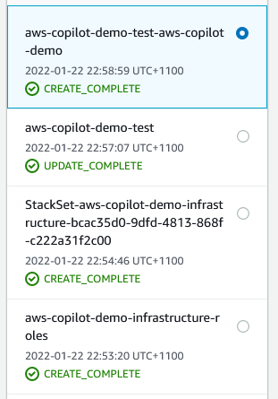

# AWS Copilot demo

Example of building and deploying an app using
[AWS Copilot](https://aws.amazon.com/containers/copilot/).

Follows the tutorial here: https://aws.amazon.com/blogs/containers/introducing-aws-copilot/

# Creating this project from scratch
This is how this repo + sit was created. You should be able to create your own
copy of this site by following these steps.

## install stuff
- sign up to AWS
- install [docker](https://www.docker.com/products/docker-desktop)
- install [aws cli](https://aws.amazon.com/cli/)
- install [copilot](https://aws.github.io/copilot-cli/docs/getting-started/install/)
- clone this repo
- `rm .workspace manifest.yml`

## init copilot, run the app!
```sh
copilot init
# choose an app name
# select 'Load Balanced Web Service'
# choose a service name (can be same as app name)
# choose the Dockerfile in this repo
# copilot starts deploying...
# ...
# select 'yes' for a test environment
# copilot creates all necessary infrastructure (phew, no cloudformation!)
# ...
# eventually, you'll get a link to your app!
```

At this point, you'll have a number of cloudformation stacks:



I don't really understand what they all do, or which one is the 'app'. I think
it's the top one??

## ops n stuff
```sh
# stream app logs to your console
copilot svc logs --follow
# you can also see these logs in AWS -> cloudwatch -> logs -> log groups ->  /copilot/aws-copilot-demo-test-aws-copilot-demo
```

# todo
- how to bring down the app?
- how to monitor costs?
